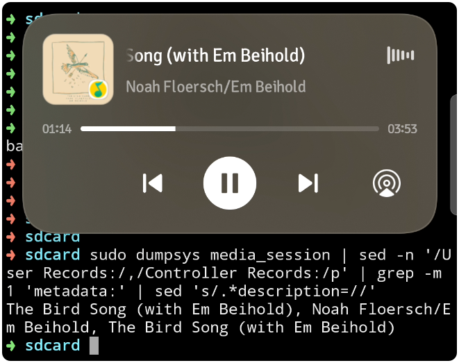
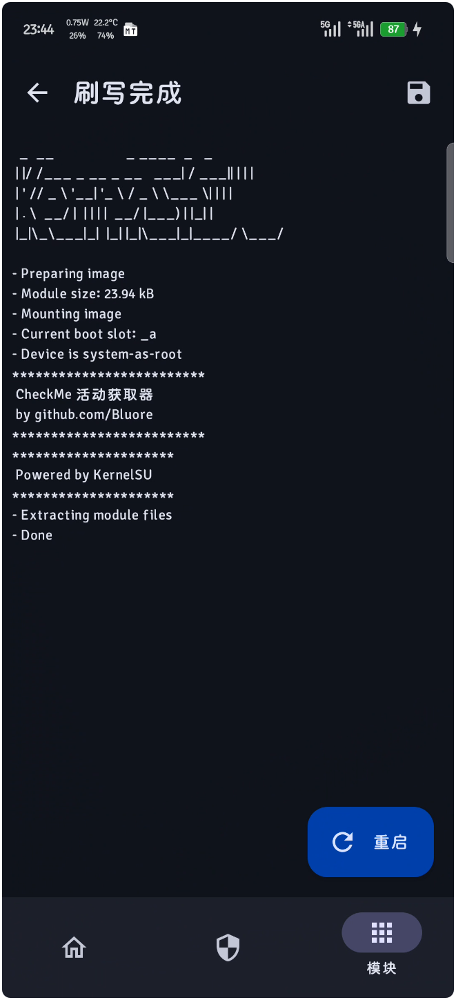
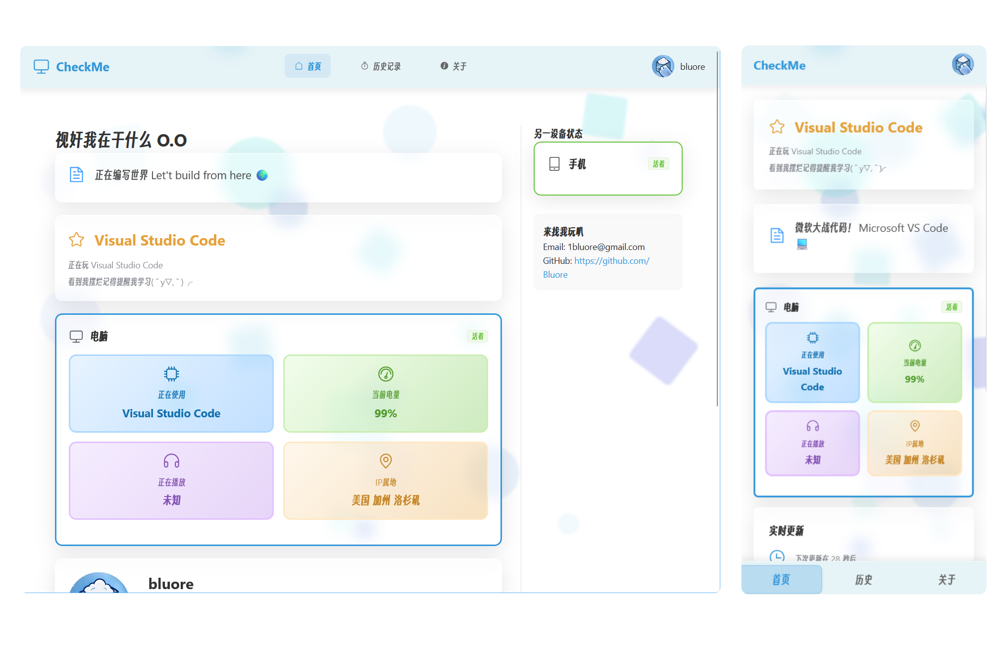

> 关于我做了个视奸我自己的网站 me.bluore.top

本文记录一下纯小白的我在写这个项目中遇到的困难

能够实时视奸自己的网页是如何完成的呢，首先我想到的困难就是数据获取的问题，以及如何长期后台保活的问题

# 获取数据

如果是Windows系统中，这个问题就很简单，可以写一个简单的py脚本即可获取并传递数据，将文件添加快捷方式到`C:\Users\<用户名>\AppData\Roaming\Microsoft\Windows\Start Menu\Programs\Startup`的文件夹下系统就会开机自启动该程序

不过如果是Android系统该如果获取数据呢？

最开始想的是，是否可以通过写一个App，通过申请无障碍权限来进行获取数据，并尽可能后台保活，可是不会Java和Android开发的我很快放弃了这个想法，不过正巧最近换了新的手机 ~（旧的没有放到转转）~ ，顺手刷了机，于是这个问题就简单了

下面记录一下我去是如何获取Android系统中的数据，并后台长期保活

## 应用进程数据如何获取 ？

```mksh
sudo dumpsys activity top | grep ACTIVITY
```

> 示例输出 ( MT资源管理器模拟终端 )

```sh + {1} with wrap=false collapse={3-13}
➜ sdcard sudo dumpsys activity top | grep ACTIVITY
  ACTIVITY com.v2ray.ang/.ui.MainActivity b6cc31a pid=(not running) userId=0 uid=10334 displayId=0(type=INTERNAL)
  ACTIVITY me.weishu.kernelsu/.ui.MainActivity 3246fc5 pid=(not running) userId=0 uid=10413 displayId=0(type=INTERNAL)
  ACTIVITY org.lsposed.manager/.ui.activity.MainActivity b5ee8f8 pid=(not running) userId=0 uid=10335 displayId=0(type=INTERNAL)
  ACTIVITY com.taobao.taobao/com.taobao.tao.welcome.Welcome f6a9a8c pid=(not running) userId=0 uid=10349 displayId=0(type=INTERNAL)
  ACTIVITY com.jingdong.app.mall/com.jd.lib.productdetail.ProductDetailActivity b14b607 pid=(not running) userId=0 uid=10396 displayId=0(type=INTERNAL)
  ACTIVITY com.tencent.mobileqq/.activity.SplashActivity cfc32cb pid=20711 userId=0 uid=10358 displayId=0(type=INTERNAL)
  ACTIVITY com.suda.yzune.wakeupschedule/.schedule.ScheduleActivity 5364210 pid=7721 userId=0 uid=10432 displayId=0(type=INTERNAL)
  ACTIVITY tv.danmaku.bili/.MainActivityV2 1e0fc74 pid=16964 userId=0 uid=10336 displayId=0(type=INTERNAL)
  ACTIVITY com.twitter.android/com.twitter.app.main.MainActivity 3b31223 pid=528 userId=0 uid=10402 displayId=0(type=INTERNAL)
  ACTIVITY com.google.android.youtube/.app.honeycomb.Shell$HomeActivity 88a1c87 pid=7596 userId=0 uid=10365 displayId=0(type=INTERNAL)
  ACTIVITY com.tencent.mm/.ui.LauncherUI 905c54c pid=24420 userId=0 uid=10356 displayId=0(type=INTERNAL)
  ACTIVITY mark.via/.Shell d839efd pid=666 userId=0 uid=10385 displayId=0(type=INTERNAL)
  ACTIVITY com.android.launcher/.Launcher 4818b2c pid=5268 userId=0 uid=10222 displayId=0(type=INTERNAL)
  ACTIVITY bin.mt.plus/l.ᩳۛ᩵ 27fd27e pid=11838 userId=0 uid=10398 displayId=0(type=INTERNAL)
```

这个命令可以获取所有的活动的应用进程的包名，不过当前活动的进程包名是哪一个?

经过数据的实践和统计发现，最后一行的包名正是当前正在使用的应用的包名，所以先通过`tail -1`筛选最近使用的应用的进程信息，再进行正则表达式进行匹配`s/.*ACTIVITY \([^/]*\)\/.*/\1/p`

完整的命令：

```mksh
sudo dumpsys activity top | grep ACTIVITY | tail -1 | sed -n 's/.*ACTIVITY \([^/]*\)\/.*/\1/p'
```

```sh {1}
➜ sdcard sudo dumpsys activity top | grep ACTIVITY | tail -1 | sed -n 's/.*ACTIVITY \([^/]*\)\/.*/\1/p'
bin.mt.plus
```

## 获取手机电量

### 通用方法

通过`dumpsys battery`通用的方法可以获取到手机的电量

> 测试机型: *一加 Ace5 ( 版本号：PKG110_15.0.0.840(CN01) )*

```mksh + {1} collapse={3-27,31-32} ! {29}
➜ sdcard sudo dumpsys battery
Current OPLUS Battery Service state:
  Charger voltage : 4757
  Battery current : -1589
  ChargerTechnology: 0
  ChargeFastCharger: false
  PlugType: 2
  UpdatesStopped: false
  UsbHwStatus: 0
  BatteryHwStatus: -2147483648
  HwStatusIsSet: 1
  BatteryIcStatus: -2147483648
  IcStatusIsSet: 1

  mUsbStatus: 0
  PhoneTemp: 330
  ThermalFeatureOn: true
Current Battery Service state:
  AC powered: false
  USB powered: true
  Wireless powered: false
  Dock powered: false
  Max charging current: 2000000
  Max charging voltage: 5000000
  Charge counter: 4864000
  status: 2
  health: 2
  present: true
  level: 87
  scale: 100
  voltage: 4402
  temperature: 325
  technology: Li-ion
  Charging state: 0
  Charging policy: 0
```

这里的`level: 87`就是手机显示的电量，完整筛选后的命令：

```mksh
sudo dumpsys battery | grep level | awk '{print $2}'
```

```sh + {1}
➜ sdcard sudo dumpsys battery | grep level | awk '{print $2}'
88
```

这样就直接获取到了当前的面板电量

> *不过这里获取到的手机电量可能并不是真实的手机电量，而是显示的面板电量(即：手机厂商想让你看到的手机电量)*

### 手机真实电量

这里就不展开说了，目前本机型的 $\mathrm{面板电量} \ne  \mathrm{实际电量}$ 

## 获取当前播放的媒体标题

有了前面的经验，这次就顺利多了，使用`dumpsys media_session`获取到一大堆信息后用`sed -n '/User Records:/,/Controller Records:/p'`筛选到用户进程，然后取第一个媒体的数据`grep -m 1 'metadata:'`( 因为最近播放的媒体会把之前后台播放的给顶掉，直接获取第一个即可 )，拿到媒体的标题`sed 's/.*description=//'`

```mksh
sudo dumpsys media_session | sed -n '/User Records:/,/Controller Records:/p' | grep -m 1 'metadata:' | sed 's/.*description=//'
```

> 执行结果：

```mksh + {1,3,5} wrap=false
➜ sdcard sudo dumpsys media_session | sed -n '/User Records:/,/Controller Records:/p' | grep -m 1 'metadata:' | sed 's/.*description=//'
The Bird Song (with Em Beihold), Noah Floersch/Em Beihold, The Bird Song (with Em Beihold)      
➜ sdcard sudo dumpsys media_session | sed -n '/User Records:/,/Controller Records:/p' | grep -m 1 'metadata:' | sed 's/.*description=//'
何御, 李姿逸RizRea, 何御
➜ sdcard sudo dumpsys media_session | sed -n '/User Records:/,/Controller Records:/p' | grep -m 1 'metadata:' | sed 's/.*description=//'
小画家！, 自动连播, null
```



可以看到，歌曲名重复了一遍

如果是播放B站视频，则歌曲名最后会显示null，这样并不美观而且会让获取的数据冗余，所以我通过`cut -d',' -f1`进行截取第一项（歌曲名）和第二项（作者名）

```sh
sudo dumpsys media_session | sed -n '/User Records:/,/Controller Records:/p' | grep -m 1 'metadata:' | sed 's/.*description=//' | cut -d',' -f1
sudo dumpsys media_session | sed -n '/User Records:/,/Controller Records:/p' | grep -m 1 'metadata:' | sed 's/.*description=//' | cut -d',' -f2
```

这两行，分别获取标题（歌曲名、视频标题）和作者（作者名、B站状态）

这样，在安卓系统中的Root环境我们便可以获取数据了

## 如何发送数据并后台保活

正巧我使用的设备是刷上KSU的Root设备，所以我使用的方案是写一个`mksh`的Shell脚本，打包成一个模块，刷入到Root管理器中，开机自启动且不会被杀后台（我没遇到过）



其实**ADB权限**也是可以的，不过会有一些限制，我就没试了 （￣︶￣） <-懒

# 代码编写

解决了核心问题，其他的就简单了

后端选择`Golang`语言，`Gin`框架+`MySQL`数据库，前端选择`Vue`然后`Deepseek`自己写 ~( vscode，你已经是一个成熟的ide了，该自己写代码了 )~ ，对于没有写过项目的我来说（刚速通完golang语法），顺便练习一下写代码的能力，所以后端边学边写，关掉了goland的整行提示 ~折磨自己~ ，自己去慢慢搓代码 ~(导致写一堆自己不想修复的Bug)~ 

本仓库使用前后端分开部署，使用不同域名（或使用Nginx来路由），桌面端支持**Windows**，手机端支持**Root + Android**

欢迎大家来部署玩玩

> - [CheckMe - Github](https://github.com/Bluore/CheckMe)

# 效果演示

桌面端&移动端



::github{repo="Bluore/CheckMe"}

