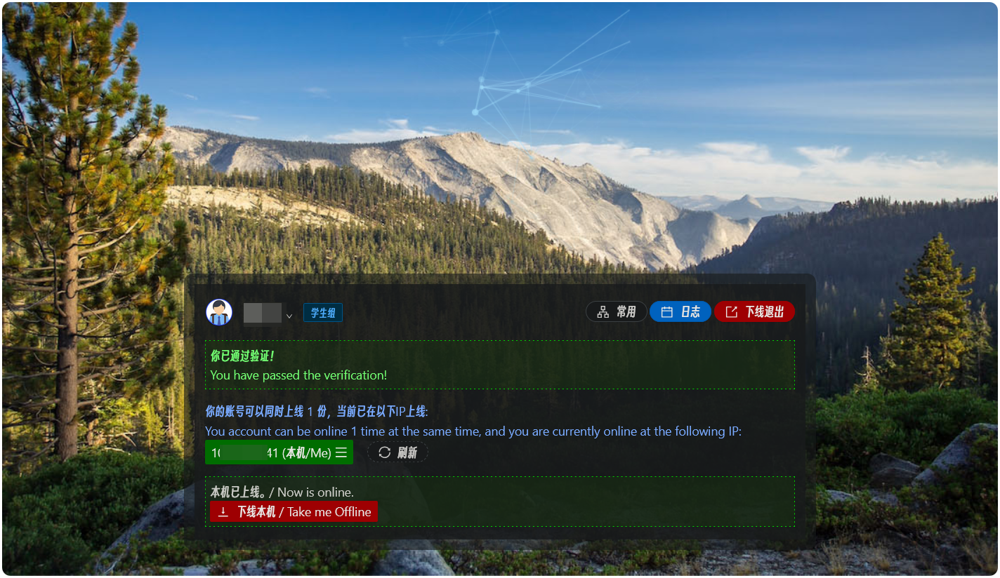
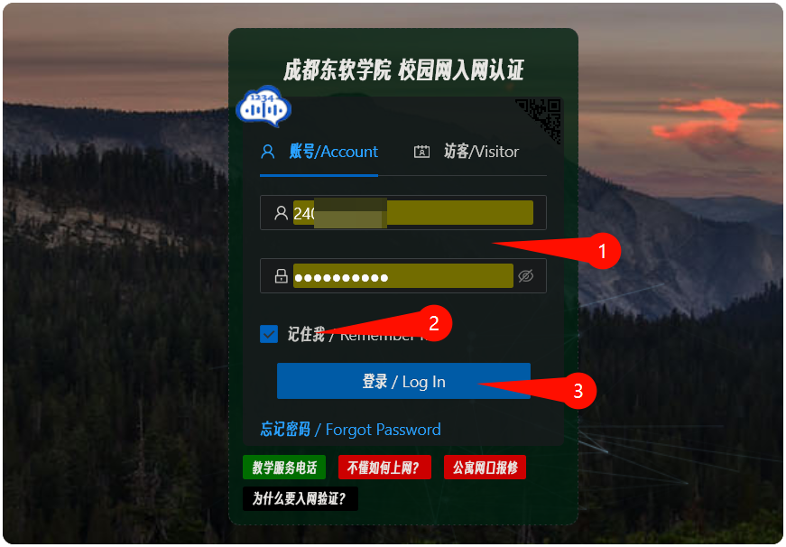
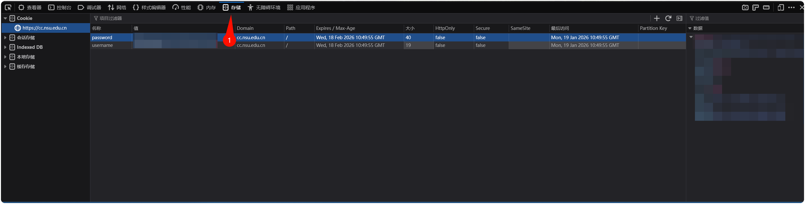
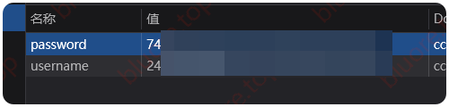

:::note

本文主要讲程序的使用

:::

为了解决校园网连接很麻烦，且一段时间后还会自动断开连接的问题，于是写了一个py程序用来自动连接校园网来简化操作和防止断开



当时写的石山代码: 

```python collapse={3-188}
import requests
import time
import json
import os

loginKey = { #默认配置
    "username" : '学号',
    "password" : '一次性密钥',       #网页登录后cookie中获取
    "testtime" : 5,                 #检测网络连接状况时差（单位s）
    "timeout" : 5,                  #超时连接失败失败（单位s）
    "outInFirstRequest" : False,    #第一次请求就连接成功是否退出程序
    "autoOutOtherIp" : True,        #自动踢出其他正在连接的IP
    "networkName" : "学生-移动-100M" #自动连接的网络名称
}

def information(type):
    if type=='loginKey':
        return '''
{ #默认配置
    "username" : '学号',             #填写自己登录校园网的学号
    "password" : '一次性密钥',       #网页登录后cookie中获取
    "testtime" : 5,                 #检测网络连接状况时差（单位s）
    "timeout" : 5,                  #超时连接失败失败（单位s）
    "outInFirstRequest" : False,    #第一次请求就连接成功是否退出程序
    "autoOutOtherIp" : True,        #自动踢出其他正在连接的IP
    "networkName" : "学生-移动-100M" #自动连接的网络名称
}
        '''

if(not os.path.exists("data.txt")):
    print("不存在配置文件，尝试创建文件")
    with open("data.txt", 'w', encoding='utf-8') as file:
        json.dump(loginKey, file, ensure_ascii=False, indent=4)
    print(information('loginKey'))
    print("已经创建配置文件，请编辑同文件夹下data.txt填写账户和一次性密钥后【重新启动】此程序")
    time.sleep(120)
    exit()

with open('data.txt', 'r', encoding='utf-8') as file:
    loginKey = json.load(file)


def testIPState(username,passwordCode):
    urlTest = "https://cc.nsu.edu.cn/Auth.ashx"
    headersTest = {
        "content-type": "application/json; charset=utf-8",
        "x-powered-by": "ASP.NET",
        "server":"Microsoft-IIS/10.0"
    }
    postTest = {
        "DoWhat": "Check"
    }
    cookieTest = {
        "username": username,
        "password": passwordCode
    }
    result = requests.post(urlTest, headers=headersTest, json=postTest, cookies=cookieTest, timeout=loginKey['timeout'])
    return result.json()


def linkNetwork(username,passwordCode):
    urlLink = "https://cc.nsu.edu.cn/Auth.ashx"
    headersLink = {
        "content-type": "application/json; charset=utf-8",
        "x-powered-by": "ASP.NET",
        "server":"Microsoft-IIS/10.0"
    }
    postLink = {
        "DoWhat": "OpenNet",
        "Package": loginKey['networkName']              #"学生-移动-100M"
    }
    cookieLink = {
        "username": username,
        "password": passwordCode
    }
    result = requests.post(urlLink, headers=headersLink, json=postLink, cookies=cookieLink, timeout=loginKey['timeout'])
    print(result.text)
    return result.json()

def loginNetwork(username,passwordCode):
    urlLink = "https://cc.nsu.edu.cn/Auth.ashx"
    headersLink = {
        "content-type": "application/json; charset=utf-8",
        "x-powered-by": "ASP.NET",
        "server":"Microsoft-IIS/10.0"
    }
    postLink = {
        "DoWhat": "Login",
        "remember":True,
        "username":username,
        "password":passwordCode
    }
    cookieLink = {
        "username": username,
        "password": passwordCode
    }
    result = requests.post(urlLink, headers=headersLink, json=postLink, cookies=cookieLink, timeout=loginKey['timeout'])
    print(result.text)

def listLinkNetwork(username,passwordCode):
    urlLink = "https://cc.nsu.edu.cn/Auth.ashx"
    headersLink = {
        "content-type": "application/json; charset=utf-8",
        "x-powered-by": "ASP.NET",
        "server":"Microsoft-IIS/10.0"
    }
    postLink = {
        "DoWhat": "GetInfo"
    }
    cookieLink = {
        "username": username,
        "password": passwordCode
    }
    result = requests.post(urlLink, headers=headersLink, json=postLink, cookies=cookieLink, timeout=loginKey['timeout'])
    print(result.text)
    return result.json()

def delLinkNetwork(username,passwordCode,ip):
    urlLink = "https://cc.nsu.edu.cn/Auth.ashx"
    headersLink = {
        "content-type": "application/json; charset=utf-8",
        "x-powered-by": "ASP.NET",
        "server":"Microsoft-IIS/10.0"
    }
    postLink = {
        "DoWhat": "CloseNet",
        "IP": ip
    }
    cookieLink = {
        "username": username,
        "password": passwordCode
    }
    result = requests.post(urlLink, headers=headersLink, json=postLink, cookies=cookieLink, timeout=loginKey['timeout'])
    print(result.text)
    return result.json()

exitFlag = False
if loginKey['outInFirstRequest']:
    try:
        getStste = testIPState(loginKey['username'], loginKey['password'])
        print("已连接网络，3秒后自动退出")
        exitFlag = True
        time.sleep(3)
    except:
        print("!>>something error")
        time.sleep(3)

while 1:
    if exitFlag == True:
        break
    try:
        getStste = testIPState(loginKey['username'], loginKey['password'])
        #print(getStste)
        print('>>>'+getStste['Message'])
        time.sleep(0.1)
        if getStste['Result']:
            if getStste['Message'] == '已上线IP，免认证！':
                time.sleep(loginKey['testtime'])
                continue
            if getStste['Message'] == '已登录IP，免认证！':
                print("!>>尝试上线本机")
                getStste = linkNetwork(loginKey['username'], loginKey['password'])
                if getStste['Message'] == '同时登录数已达上限！':
                    if not loginKey['autoOutOtherIp']:
                        time.sleep(loginKey['testtime'])
                        continue
                    #print("其他设备正在上线中，将在10秒后重试")
                    print(">>>其他设备正在上线中，正在尝试查询其他设备")
                    getStste = listLinkNetwork(loginKey['username'], loginKey['password'])
                    time.sleep(0.1)
                    print(">>>其他设备正在上线中，正在尝试查询其他设备")
                    getStste = delLinkNetwork(loginKey['username'], loginKey['password'], getStste['Data']['OIA'][0]['IP'])
                    if(getStste['Result']):
                        print(f">>>已成功下线IP({getStste['IP']})，正在尝试上线本设备")
                        time.sleep(0.1)
                        continue
                    print(f">>>下线IP({getStste['IP']})失败，请求返回信息{getStste['Message']}")
                    time.sleep(5)
                continue
        if getStste['Result'] == 'needLogin':
            print("!>>尝试自动登录")
            loginNetwork(loginKey['username'], loginKey['password'])
        if not getStste['Result']:
            if getStste['Message'] == '请求太频繁，请稍后再试...':
                print("3秒后重试")
                time.sleep(3)
    except:
        print("!>>something error")
        time.sleep(3)

exit()
```

::github{repo="Bluore/NSUnetwork"}

# 使用方法

下载程序[Github](https://github.com/Bluore/NSUnetwork/releases/tag/main)

:::tip
`nsunetowrk_console.exe`版本运行后会有控制台输出

` nsunetowrk_NO-console.exe`版本运行后没有控制台输出，后台无感运行
:::

## 使用软件

首次打开时会出现提示：

```sh               
不存在配置文件，尝试创建文件

{ #默认配置
    "username" : '学号',             #填写自己登录校园网的学号
    "password" : '一次性密钥',       #网页登录后cookie中获取
    "testtime" : 5,                 #检测网络连接状况时差（单位s）
    "timeout" : 5,                  #超时连接失败失败（单位s）
    "outInFirstRequest" : False,    #第一次请求就连接成功是否退出程序
    "autoOutOtherIp" : True,        #自动踢出其他正在连接的IP
    "networkName" : "学生-移动-100M" #自动连接的网络名称
}

已经创建配置文件，请编辑同文件夹下data.txt填写账户和一次性密钥后【重新启动】此程序
```

打开文件目录下的`data.txt`文件按提示编辑，如何填写请看后文

填写完成后请再次运行程序即可自动连接

> `autoOutOtherIp` 为 `True`时会自动踢出其他设备

## 获取`username`和`password`

先登录账号



按下`F12`打开控制台，进入`存储`栏(也可能叫`应用`、`Application`)



复制值到配置文件即可



## 如何开机自启动

按下`Win + R`按键打开运行面板，输入

```
shell:startup
```

打开文件夹，将程序的快捷方式放入该文件夹即可

> 文章实际发布时间`2026-1-19`
