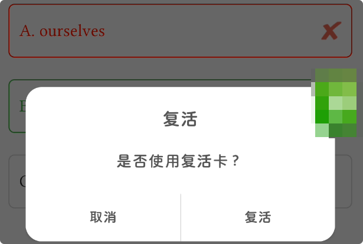
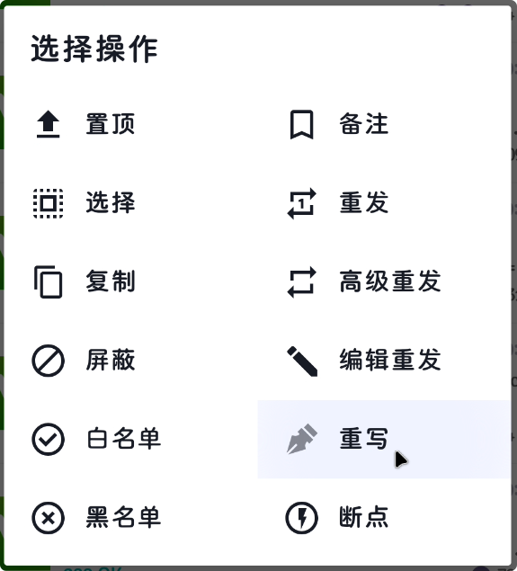
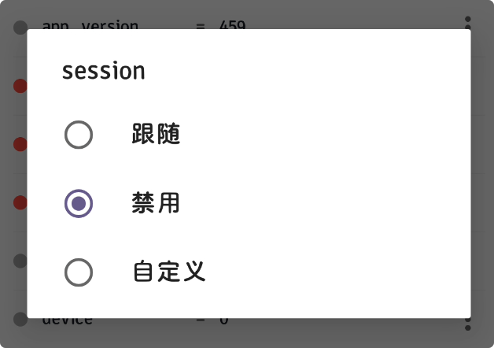
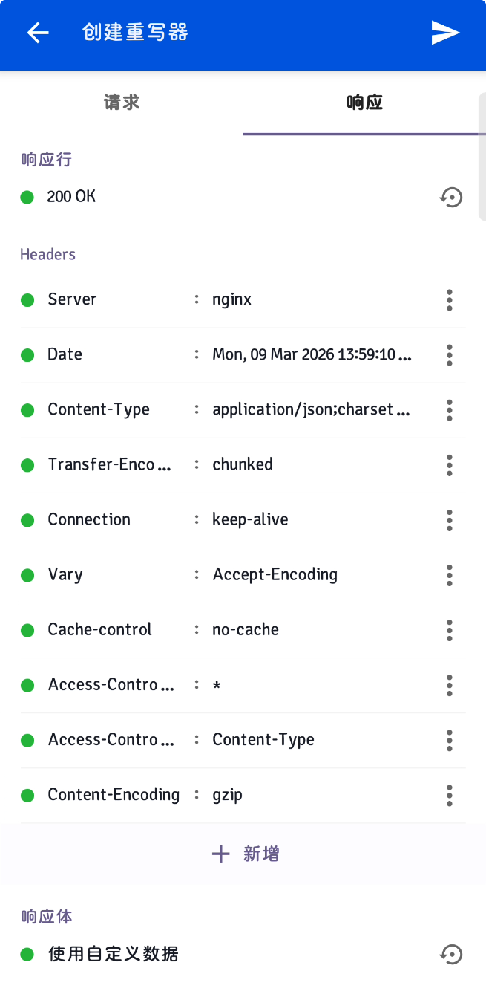
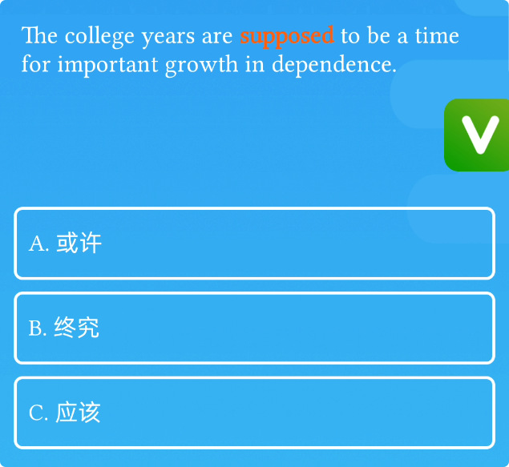
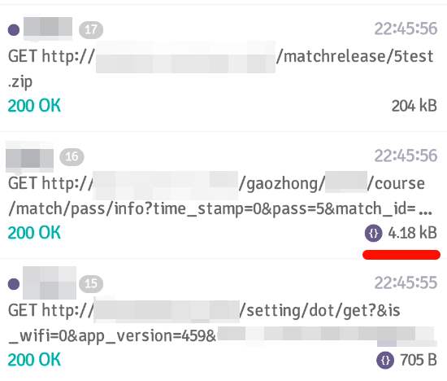
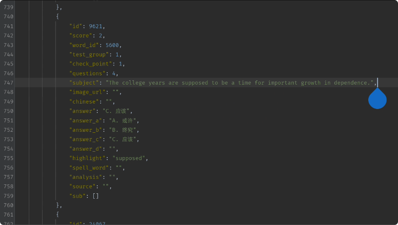
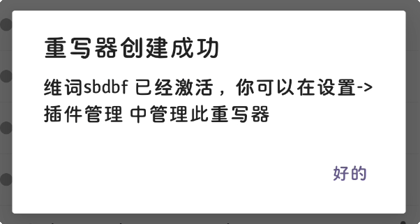
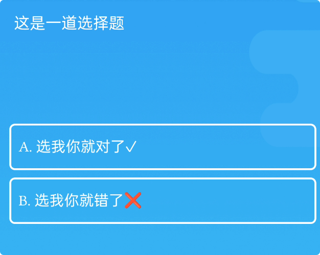
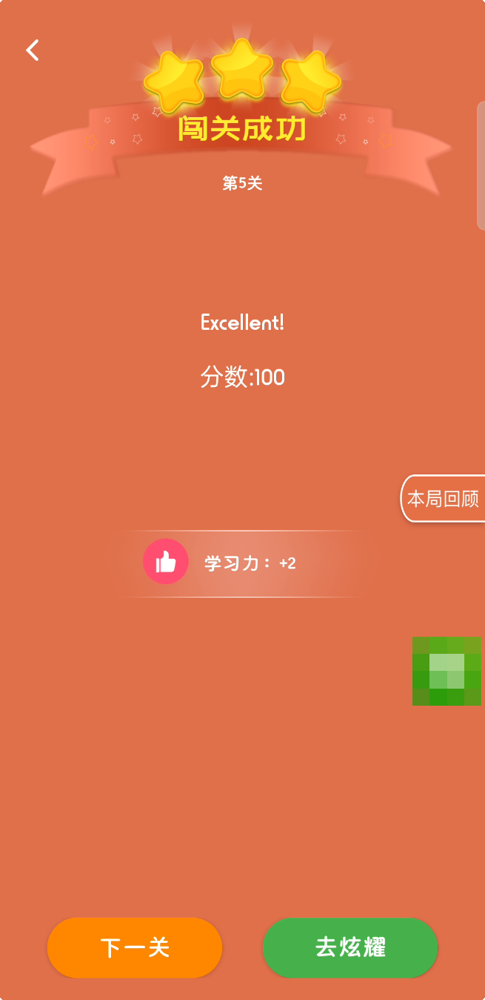

> 以前高中的时候英语老师在`某词`上布置任务，不过这个软件有很多可以破解的地方，已经过去3年了但还是来分享一下

本文来分享一下某词软件抓包和重写过程

~~之前直接刷到了单词闯关的全国第三，不过后面被回档了~~

目标：`某词王刷榜` 和 `某词闯关刷榜`

# 使用前置工具

[HttpCanary](https://github.com/search?q=HttpCanary&type=repositories) - 抓包和请求重写软件 `本场MVP`

*[Layout Inspect](https://github.com/Xposed-Modules-Repo/com.flass.layoutinspect) - 去除截屏限制

*[自动精灵](https://zdjl.cc/) - 自动化操作

# 某词王刷榜

先启动**HttpCanary**来进行抓包，然后开始进入挑战

进入随便错选一个，会出现一个**复活弹窗**



检查一下相关的请求响应

```json title="获取复活卡数量 - 响应内容" mark="revival_num"
{
  "revival_num": 51,
  "description": "success",
  "result_code": 200
}
```

明显知道`revival_num: 51`就是剩余复活卡的数量

当点击`复活`后的请求

```json title="消耗复活卡 - 请求和响应" {"请求":1-6} ins={"响应":7-11}
-
GET /gaozhong/******/group/arena/revival/use?&is_wifi=0&app_version=459&user_code=***********&bound_id=***********************&session=*********************&app_id=8&device=0&platform=1 HTTP/1.1
Host: api.******.com
Connection: Keep-Alive
Accept-Encoding: gzip
User-Agent: okhttp/3.11.0
-
{
  "description": "success",
  "result_code": 200
}
```

当你复活会主动告诉服务器并消耗掉一个`复活卡`，由于检查了一下请求，整个挑战没有做后端校验所以可以无限制的使用这个`附魔了无限的复活卡`

所以思路就是**屏蔽掉消耗复活卡的请求并伪造自己拥有足够的复活卡**

如果没有复活卡，这里可以通过`HttpCanary`来重写请求，修改`revival_num`参数（剩余复活卡的数量）

以下就是操作的方法


点击`重写`，然后起名添加`重写器`


禁用掉`session`

注意这里禁用请求中登录信息相关的内容，这样就无法消耗复活卡


然后将`响应`改成`200`的返回码，`响应体`固定为**原来的数据**，其他的请求头参数全部固定为原来一样，然后添加这个重写器

:::warning
注意`抓包模式`不要关，一直开着才有效果
:::

好了，现在你拥有了`附魔了无限的复活卡`，配合`Layout Inspect`（用来去掉截取屏幕限制，需要ROOT）+`自动精灵`（自动化操作）就可以全自动化刷榜了，无限使用复活卡

:::tip
如果复活卡数量不够，同理更改响应自己的复活卡的数量即可
:::

# 某词闯关刷榜

和上一个一样的套路，先抓包分析一下



获取完试题看一下`HttpCanary`



这里优先看一下体积较大的请求



从响应里面明显能看到上面图片的题目内容

稍微分析一下这个响应内容可以发现，有50道题目，每道题2分，且答案是直接写在试卷上的 ~~(像极了练习册上没有撕掉的答案)~~

这里对响应内容稍作修改：

```json title="修改题目信息" {7,15-17}
{
    "pass_info": {
        "source": "/matchrelease/5test.zip",
        "test": [
            {
                "id": 114514,
                "score": 100,
                "word_id": 8697,
                "test_group": 1,
                "check_point": 1,
                "questions": 5,
                "subject": "这是一道选择题",
                "image_url": "",
                "chinese": "",
                "answer": "A. 选我你就对了✓",
                "answer_a": "A. 选我你就对了✓",
                "answer_b": "B. 选我你就错了❌",
                "answer_c": "",
                "answer_d": "",
                "highlight": "",
                "spell_word": "",
                "analysis": "",
                "source": "",
                "sub": []
            }
        ],
        "release_time": 1751111182
    },
    "description": "success",
    "result_code": 200
}
```

这里让这个试题只有一个题目



同理，将这个文件上传到响应，创建`重写器`

开始闯关吧~



看到这个就成功了✌️



结算画面

:::warning
仅供参考学习，我已经被清空战绩了 T_T
:::

